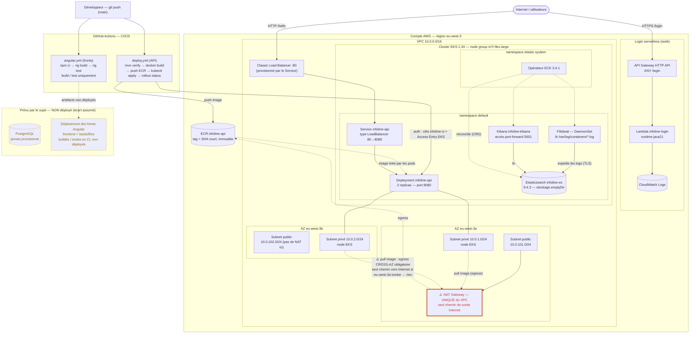

# Architecture

## Schéma global

Diagramme de l'architecture **réellement déployée** (rendu nativement par GitHub). Les
composants du sujet non déployés — PostgreSQL et le *déploiement* des fronts Angular — sont
regroupés en bas, en pointillés, comme **écart assumé** (le pourquoi est détaillé dans les
sections dédiées ci-dessous). Chaque bloc correspond à du code versionné : `terraform/`
(VPC, EKS, Lambda, ECR, IAM), `k8s/` + `k8s/elk/` (workloads), `.github/workflows/` (CI/CD).

> **Comment lire ce schéma.** Deux chemins d'entrée indépendants (loi de Conway, § plus bas) :
> l'API métier `/hello` transite par le Classic Load Balancer jusqu'aux pods sur EKS ; le login
> `/login` est servi par une Lambda derrière API Gateway, totalement isolée du cluster (ses logs
> vont dans CloudWatch, pas dans Elasticsearch). La supervision ELK tourne *dans* le cluster :
> Filebeat (un pod par nœud) collecte les logs de tous les pods et les pousse vers Elasticsearch,
> Kibana les explore. La CI/CD ne déploie que l'API ; les fronts s'arrêtent au build/test.
>
> **⚠️ Faille visible sur ce schéma — la NAT est un SPOF ancré dans une seule AZ.**
> `single_nat_gateway = true` place l'unique NAT Gateway dans le premier subnet public de la
> liste (`10.0.101.0/24`, donc **`eu-west-3a`**) — mais elle sert **les deux** subnets privés :
> le node de `eu-west-3b` doit traverser l'AZ pour l'atteindre (flèche rouge). Si `eu-west-3a`
> tombe, le node de `eu-west-3b` **perd toute sortie Internet** : plus aucun `docker pull` depuis
> ECR, donc **plus aucun nouveau déploiement** (le pipeline échoue au `rollout status`), même si
> le pod déjà en route sur `eu-west-3b` continue de répondre en entrant (le trafic ELB → pod ne
> passe pas par la NAT). Détail complet et corrigé de calcul :
> `fiches-essentielles/exercice-reseau-vpc.md` (partie B). Correctif de prod identifié : une NAT
> par AZ (§ « Pourquoi un seul NAT Gateway » ci-dessous).
>
> Ce schéma n'est **pas exporté en image dans la copie** : trop large pour rester lisible sur
> une page, il est consulté directement dans le dépôt, où GitHub le rend automatiquement. La
> copie y renvoie en introduction de l'Activité 1.

## Choix techniques par composant

*Une section par brique de l'architecture : ce qui est provisionné, et pourquoi ces
options plutôt que d'autres. Les décisions qui traversent plusieurs briques (association
EKS + Lambda, Terraform, découpe en composants) sont regroupées plus bas, section
« Choix techniques transverses ».*

## Cluster Kubernetes — Amazon EKS

### Ce qui est provisionné
- **VPC dédié** : 10.0.0.0/16, 2 zones de disponibilité (eu-west-3a/3b)
- **Subnets privés** : 10.0.1.0/24, 10.0.2.0/24 — accueillent les nodes (pas d'IP publique directe)
- **Subnets publics** : 10.0.101.0/24, 10.0.102.0/24 — NAT Gateway, futurs Load Balancers
- **NAT Gateway unique** : sortie Internet pour les nodes privés (single_nat_gateway = true)
- **Cluster EKS** : infoline-eks, Kubernetes 1.34, région eu-west-3
- **Node group "main"** : ON_DEMAND, min 1 / max 3 (autoscaling) — `t3.micro` en Phase 1-3, puis `m7i-flex.large` en Phase 4 pour héberger Elasticsearch (cf. « Pourquoi m7i-flex.large » plus bas)

### Pourquoi EKS plutôt que Kubernetes auto-installé (kubeadm)
AWS gère entièrement le **control plane** (API server, etcd, scheduler, controller manager) — zéro maintenance de ces composants, zéro gestion des certificats TLS, haute disponibilité incluse. Ce qui reste sous notre responsabilité : le node group (taille, version, patchs OS) et les workloads déployés.

### Pourquoi un seul NAT Gateway
Arbitrage coût/résilience cohérent avec le budget limité d'InfoLine. Un NAT Gateway par AZ serait plus résilient mais deux fois plus coûteux. Décision à revoir en production réelle.

**Faille assumée (single point of failure) :** avec `single_nat_gateway = true`, le module place l'unique NAT dans le premier subnet public de la liste (`10.0.101.0/24` → **eu-west-3a**), mais elle sert les deux subnets privés — le node de `eu-west-3b` route son trafic sortant **à travers l'AZ** pour l'atteindre (cf. schéma ci-dessus). Si `eu-west-3a` tombe : le node de `eu-west-3b` perd toute sortie Internet (plus de `docker pull` depuis ECR) → **plus aucun nouveau déploiement** possible, tandis que le trafic déjà en cours vers un pod survivant continue de répondre (l'entrant ELB → pod ne dépend pas de la NAT). Nommé explicitement plutôt que caché derrière l'argument « 2 AZ = résilient » : la résilience porte sur le *calcul* (nodes/pods), pas sur l'*egress*. Correctif de production : une NAT Gateway par AZ (coût doublé, assumé hors budget ECF).

**Chiffré — ce que coûterait la 2ᵉ NAT (correctif) :** une NAT Gateway facture deux choses : une **charge horaire fixe** par passerelle déployée (≈ $0,059/h à Paris) et un **traitement de données** (≈ $0,059/Go), *tarifs publics approximatifs, à revérifier sur la AWS Pricing Calculator avant citation définitive dans la copie — même prudence que le chiffrage Lambda ci-dessous*. Une 2ᵉ NAT **double la charge horaire** (~$0,118/h au lieu de ~$0,059/h) mais **ne double pas** le traitement de données : le volume total de trafic sortant reste le même, juste réparti sur 2 passerelles — et il est de toute façon négligeable ici (images Docker petites, hello world). Sur un mois **entier en 24/7**, le surcoût serait d'environ **$43/mois**. Mais rapporté à l'usage réel du projet — EKS (et sa NAT) détruit chaque soir/week-end, ~112 h de budget total sur tout le projet — le surcoût réel tombe à environ **$6-7 pour l'ensemble du projet**. **Nuance honnête pour l'oral** : à ce niveau, l'argument « coût » pour justifier une seule NAT est correct mais budgétairement faible en absolu sur ce périmètre précis ; la vraie valeur du choix est de **démontrer un arbitrage coût/résilience explicite et documenté**, pas d'avoir réellement économisé une somme significative — la 2ᵉ NAT reste identifiée comme correctif de production, pas rejetée pour incapacité budgétaire réelle.

### Pourquoi des nodes en subnets privés
Les nodes ne sont pas directement joignables depuis Internet. Seul le trafic entrant via un Load Balancer (subnet public) ou le NAT Gateway (sortie vers Internet) est autorisé. Réflexe sécurité de base : réduire la surface d'attaque.

### Pourquoi t3.micro (contrainte de compte, pas un choix d'architecture)
Le type `t3.medium` initialement visé était indisponible sur ce compte AWS de test — repli sur `t3.micro`. C'est une **contrainte de compte assumée**, pas une décision d'architecture (en production réelle, `t3.medium` ou plus serait retenu). Conséquence concrète découverte à l'usage : `t3.micro` plafonne à **4 pods par node** (limite ENI/CNI du VPC AWS, fonction du type d'instance), contre ~17 sur `t3.medium`. Ce plafond borne directement les stratégies de déploiement possibles — il a contraint le rolling update du Deployment `infoline-api` (`k8s/api-deployment.yaml`), cf. `doc_project/FRICTIONS.md`, session Jeu 9 juil.

> **Précision apportée en Phase 4** : la cause exacte de l'« indisponibilité » de `t3.medium` a été identifiée — c'est une restriction **Free Tier** du compte (refus au lancement des types non éligibles), pas une pénurie. Pour héberger Elasticsearch (≥ 4 GiB), le node group est passé à `m7i-flex.large` (8 GiB, éligible Free Tier). Voir la section « Supervision par les logs — ELK » et `FRICTIONS.md` F11.

### Modules Terraform utilisés
- `terraform-aws-modules/vpc/aws ~> 5.8` — référence communauté, gère tables de routage, NACL, tags EKS
- `terraform-aws-modules/eks/aws ~> 20.0` — gère control plane, IAM roles, security groups, node group managé

### Surveillance à prévoir
- Versions EKS : support standard ~14 mois. Vérifier avant chaque session longue.
- Coût à l'heure : control plane EKS (~0.10$/h) + NAT Gateway + EC2. `terraform destroy` obligatoire hors session.

---

## Service serverless — AWS Lambda (login)

### Ce qui est provisionné
- **Fonction Lambda** `infoline-login` — runtime `java21`, handler `com.infoline.login.LoginHandler::handleRequest`, hello world (pas de vraie logique d'authentification, cf. contrainte de non sur-développement applicatif)
- **API Gateway HTTP API (v2)** `infoline-login-api` — route `ANY /login`, intégration proxy, stage `$default` en auto-déploiement
- **Rôle IAM dédié** `infoline-login-exec-role` — uniquement la policy managée `AWSLambdaBasicExecutionRole` (logs CloudWatch), aucun droit large
- Composant Terraform isolé (`terraform/lambda-login/`), même modèle que `terraform/eks/` : state, variables et cycle de vie séparés de l'API sur EKS

### Pourquoi Lambda plutôt qu'un service toujours allumé
Le login est une fonction courte, sans état, invoquée de façon irrégulière : facturation à l'usage plutôt qu'un serveur permanent, cohérent avec le budget limité d'InfoLine. Correspond aussi à l'exigence du sujet de séparer les applications pour qu'un incident sur l'une n'affecte pas les autres (login isolé de l'API métier sur EKS).

Chiffré : un appel à `/login` coûte environ $0,000002 (API Gateway HTTP API à $1/million de requêtes + Lambda à $0,20/million + durée d'exécution) — zéro appel, zéro facture, sans palier minimum. À comparer au control plane EKS, facturé à l'heure (~$0,10/h) qu'il soit utilisé ou non : c'est cette différence de modèle de facturation, pas une règle générale, qui justifie de détruire `eks/` chaque soir mais pas `lambda-login/`. Franchise gratuite : 1M requêtes + 400 000 Go-secondes Lambda gratuites en permanence ; 1M requêtes API Gateway HTTP API gratuites pendant les 12 premiers mois du compte AWS.

### Trois niveaux de permission distincts
Un point de confusion fréquent : ces trois questions ne se répondent jamais l'une par l'autre.

| | Contrôle quoi | Relation | Ressource Terraform |
|---|---|---|---|
| Accès utilisateur à `/login` | Un utilisateur doit-il s'identifier pour atteindre la route | Utilisateur ↔ API Gateway | `authorization_type` / `api_key_required` sur la route |
| Invocation de la Lambda | API Gateway a-t-il le droit technique d'invoquer la fonction | API Gateway (service) ↔ Lambda | `aws_lambda_permission` |
| Exécution du code | Une fois lancé, le code a-t-il le droit de faire autre chose que logger | Lambda en cours d'exécution ↔ reste d'AWS | rôle IAM d'exécution (`infoline-login-exec-role`) |

### Pourquoi Java plutôt que le langage le plus rapide à écrire
Le sujet InfoLine spécifie explicitement une fonction Java pour le login. Le handler reste volontairement minimal (aucune dépendance externe, pas de framework) pour respecter le timeboxing : seul le triplet Terraform → build Maven → API Gateway est démontré, la vraie logique d'authentification restant hors périmètre de cet ECF.

### Packaging
Le jar est construit en amont par Maven (`mvn -f lambda-login package`, projet à la racine du repo) plutôt que zippé par Terraform à l'apply — nécessaire pour du code compilé. `lambda.tf` référence directement le jar buildé via `filebase64sha256` pour ne redéployer qu'en cas de changement de code.

---

## Application API — Spring Boot

### Ce qui est réalisé
- **Application** : Java 21 + Spring Boot 4.1.0, dépendance unique `spring-boot-starter-webmvc` (stack Servlet/Tomcat). Un endpoint `GET /hello` → `Hello from InfoLine API`. Port `8080` déclaré explicitement dans `application.properties`.
- **Image Docker** : `infoline-api:local`, construite par un Dockerfile **multi-stage** (`api/Dockerfile`), ~92 Mo. Le conteneur tourne sous un utilisateur non-root `spring` et répond HTTP 200 sur `/hello`.
- Projet Maven isolé à la racine du repo (`api/`), même modèle que `lambda-login/` : build indépendant, propre cycle de vie.

### Pourquoi Java / Spring Boot
Imposé par le sujet InfoLine (« application Java spring boot »). Java 21 est retenu par cohérence avec le runtime `java21` déjà utilisé côté Lambda — un seul couple langage/version à maintenir sur tout le projet. L'applicatif reste volontairement trivial (un endpoint, aucune logique métier) : le livrable noté est l'empaquetage et le déploiement, pas le code applicatif.

### Pourquoi un Dockerfile multi-stage
`mvn package` doit **compiler** avant de produire un jar exécutable : le build a besoin du **JDK complet + Maven**, alors que l'exécution ne réclame que le **JRE**. Sans multi-stage, l'image finale embarquerait Maven, le code source et tout l'outillage de build — inutile à l'exécution et lourd. Le multi-stage sépare un stage `build` (tout l'outillage, jetable) d'un stage `runtime` qui ne récupère que le `.jar`. Résultat mesuré : ~92 Mo au lieu d'une image chargée de tout le tooling.

Bénéfice de correction connexe : contrairement au packaging Lambda (Terraform ne relit que le hash d'un jar déjà sur disque — piège du jar périmé, cf. `RUNBOOK.md`), `docker build` recompile le jar depuis la source à chaque build. Une image avec du code périmé est impossible par construction.

### Pourquoi eclipse-temurin, et la variante -jre-alpine
`openjdk` est déprécié sur Docker Hub ; `eclipse-temurin` est la distribution OpenJDK standard actuelle. La variante `-jre-alpine` donne une image minimale — sans risque ici car Spring Web n'a **aucune dépendance native** (le garde-fou Alpine des libs à compilation native, cf. fiche B2 P3, ne s'applique pas). À reconsidérer si une lib JNI est ajoutée un jour.

### Pourquoi un utilisateur non-root
Le conteneur tourne sous un utilisateur dédié `spring` (créé dans le stage runtime), pas `root` — réflexe de moindre privilège cohérent avec le rôle IAM minimal de la Lambda. Réduit la surface d'attaque si le process est compromis. Trois lignes de Dockerfile, aucun coût.

### Ordre des couches et cache de build
`pom.xml` est copié et les dépendances téléchargées (`dependency:go-offline`) **avant** le code source : un changement de code n'invalide pas la couche (coûteuse) de téléchargement des dépendances. Principe « ce qui change le moins souvent en haut » (fiche B2 P3).

### Lien avec la suite
L'image est désormais poussée sur ECR (tag = SHA court du commit) et déployée sur EKS — d'abord **manuellement** (section suivante), avant automatisation par pipeline CI/CD (A2-Q3, Phase 3).

## Déploiement de l'API sur EKS

### Ce qui est réalisé
L'image ECR est déployée sur le cluster EKS de la Phase 1 via deux manifestes versionnés (`k8s/`) : un `Deployment` à 2 replicas et un `Service` `type: LoadBalancer`. Vérifié de bout en bout — `curl http://<elb-dns>/hello` → `Hello from InfoLine API`. Étape faite **à la main** (`kubectl apply`) avant d'être automatisée par le pipeline CI/CD (A2-Q3).

### Pourquoi un déploiement manuel d'abord
Sentir la friction avant de l'automatiser : ~7 commandes dans un ordre précis, une dépendance invisible (le cluster détruit la veille doit être réveillé par un `terraform apply` de ~15-20 min), et aucune trace de qui a déployé quoi ni quand. Ces trois manques sont exactement la justification du pipeline CircleCI (fiche B2 P4) — on ne peut pas argumenter la valeur du CI/CD sans avoir vécu le déploiement manuel.

### Pourquoi `type: LoadBalancer` (et un Classic Load Balancer)
`type: LoadBalancer` demande à Kubernetes de provisionner un load balancer cloud qui expose le Service sur un DNS public. Sur EKS **sans** AWS Load Balancer Controller installé, c'est le contrôleur *in-tree* legacy qui répond : il crée un **Classic Load Balancer**, sans rien à installer. Suffisant pour exposer un hello world. Le chemin réel est Internet → ELB (port 80) → NodePort (attribué automatiquement par Kubernetes) → kube-proxy → pod (`targetPort: 8080`) : trois sauts, seuls `port`/`targetPort` configurés à la main. Un ALB/NLB via le contrôleur dédié serait le choix de production (Ingress, HTTPS, path-routing) — non requis ici.

### Pourquoi 2 replicas
Deux pods sur deux nodes : la perte d'un pod ou d'un node ne coupe pas le service, sans sur-dimensionner un hello world. C'est aussi ce qui rendra un futur *rolling update* visible en CI/CD (un nouveau ReplicaSet monte pendant que l'ancien descend — le hash dans le nom du pod change).

### Pourquoi `maxSurge: 0` / `maxUnavailable: 1` (rolling update séquentiel)
La stratégie de rolling update par défaut (`maxSurge: 25 %`, soit +1 pod pendant la bascule) suppose de la marge pour faire coexister l'ancien et le nouveau pod. Impossible sur des nodes `t3.micro` déjà proches de leur plafond de 4 pods (cf. « Pourquoi t3.micro ») : le pod surnuméraire reste `Pending` (`Too many pods`). Fixé à `maxSurge: 0` / `maxUnavailable: 1` — les 2 replicas se remplacent **un à la fois**, jamais plus de 2 pods simultanés. Contrepartie assumée : le rollout devient **séquentiel** donc plus lent (~90-110 s, démarrage JVM + readiness par pod), ce qui impose un `--timeout` de 240 s côté pipeline (le garde-fou `kubectl rollout status` échouerait sinon sur un déploiement pourtant sain — cf. `FRICTIONS.md`, Friction 10). Un node plus grand (`t3.medium`+) rendrait le rolling update parallèle par défaut viable.

### Pourquoi des probes sur `/hello`
La `readinessProbe` retire un pod des cibles du Service tant qu'il ne répond pas (évite d'envoyer du trafic à un Spring Boot encore en démarrage) ; la `livenessProbe` redémarre le conteneur s'il se fige. Faute d'endpoint `/actuator/health` dédié (Spring Actuator non ajouté — applicatif trivial), les deux pointent sur `/hello`, le seul endpoint existant. `initialDelaySeconds` couvre le temps de démarrage de la JVM.

### Pourquoi le tag d'image = SHA court du commit
Le tag ECR est le SHA court du commit (`git rev-parse --short HEAD`), jamais `latest` : chaque image est rattachée à l'état exact du repo qui l'a produite, et un rollback (`kubectl set image`) reste traçable. Contrainte alignée sur ECR configuré en tags **immuables** (un tag ne peut pas être ré-poussé — cf. `FRICTIONS.md`).

### Point de cohérence traité en Phase 3
Le repo ECR, créé hors Terraform, a été réintégré par `terraform import` — voir section CI/CD ci-dessous (« Pourquoi ECR en IaC ») pour le détail.

## CI/CD

### Pourquoi GitHub Actions (et pas CircleCI comme initialement prévu)
Le choix initial était CircleCI (cité par le sujet InfoLine). Après un blocage
account-level irrésolvable côté CircleCI (repos jamais listés malgré une GitHub App
correctement installée avec "All repositories" — cf. FRICTIONS.md, session Jeu 9 juil) et
un support inaccessible sans plan payant (ticket #173426), bascule sur GitHub Actions.
Justification technique, pas seulement de contournement : le
code étant déjà hébergé sur GitHub, GitHub Actions est l'outil CI/CD natif de la plateforme
— aucune intégration OAuth/App tierce à maintenir, le pipeline vit dans le même repo que le
code (`.github/workflows/`). La logique du pipeline est inchangée par rapport à ce qui était
conçu pour CircleCI : build+test Maven → build image Docker → push ECR (tag = SHA court du
commit) → déploiement EKS (substitution de l'image dans le manifeste puis `kubectl apply`) →
`kubectl rollout status` comme garde-fou qui fait échouer le job si le déploiement ne converge
pas. L'infra sous-jacente (ECR en IaC, utilisateur IAM `infoline-ci`, Access Entry EKS) est
réutilisée telle quelle, découplée de l'outil CI — ce découplage est en soi une preuve de
maturité (pipeline portable entre deux outils).

Pipeline **validé vert de bout en bout** (10 juil) : build/test/déploiement de l'API + build/test des
deux fronts Angular, rolling update réel prouvé (nouveau ReplicaSet, ancien retiré) — captures et
détail dans `doc_project/A2-Q3_synthese.md` / `A2-Q5_synthese.md`.

### Pourquoi l'image du Deployment est un placeholder substitué en CI
Le manifeste `k8s/api-deployment.yaml` porte `image: IMAGE_PLACEHOLDER`, pas une référence ECR en dur.
Le pipeline substitue la vraie référence (`<compte>.dkr.ecr…/infoline-api:<SHA>`, construite depuis les
secrets GitHub) juste avant `kubectl apply`. Deux bénéfices : (1) l'ACCOUNT_ID n'est plus commité en
clair dans un fichier suivi (le repo devient public pour le jury) ; (2) le manifeste est **agnostique du
compte/registre**, rejouable ailleurs sans modification. Le déploiement et la mise à jour d'image se
font en une seule opération (`apply`) — le `kubectl set image` séparé n'est plus nécessaire.

### Pourquoi un utilisateur IAM CI dédié (`infoline-ci`) et une Access Entry EKS
Moindre privilège : le CI n'a besoin que de pousser sur ECR et de mettre à jour un
Deployment. `infoline-ci` porte donc une policy minimale (push/pull ECR +
`eks:DescribeCluster`), distincte du compte `terraform-ecf` à droits larges — si les clés
CI fuient, le blast radius est limité. Sur EKS, deux couches d'autorisation cohabitent :
IAM (authentification AWS) et RBAC Kubernetes (autorisation dans le cluster). Une Access
Entry (mécanisme moderne EKS, pas `aws-auth` legacy) fait le pont et associe la policy
`AmazonEKSEditPolicy` à `infoline-ci` ; sans elle, `kubectl` renvoie Unauthorized même avec
des credentials AWS valides.

### Pourquoi ECR en IaC (référence, pas discipline de coût)
Le repo ECR a été créé hors Terraform en Phase 3 partie 1 (urgence du premier déploiement
manuel), puis réintégré par `terraform import`. Contrairement à EKS, ECR n'a pas de cycle
destroy/apply par session (facturé au stockage, quasi nul, comme Lambda) : l'IaC ici sert
la traçabilité et la reproductibilité du run final (22 juil), pas une discipline de coût
quotidienne.

### Amélioration de production non retenue : OIDC
GitHub Actions permet une authentification AWS sans clés longue durée (OIDC + rôle IAM de
confiance). Non retenu ici pour respecter le timeboxing (les clés `infoline-ci` étaient
déjà en place et fonctionnelles) ; noté comme durcissement de production possible, au même
titre que S3+CloudFront pour le front ou un ALB via contrôleur dédié.

### Pourquoi un script de reconstruction centralisé

L'infrastructure est détruite chaque soir pour ne pas payer les nœuds EKS à l'heure. Elle
doit donc pouvoir être **reconstruite intégralement, dans le bon ordre, sans intervention
manuelle** — c'est la contrepartie de cette discipline, et c'est aussi la démonstration la
plus directe de ce qu'apporte l'IaC.

L'ordre de dépendance n'est pas trivial : ECR → IAM-CI → Lambda → EKS. Ces composants ont
des états Terraform indépendants, mais tous doivent exister avant le déploiement
applicatif. Deux pièges s'y ajoutent, tous deux vécus : le jar de la Lambda doit être
recompilé **avant** le `terraform apply` (Terraform ne lit que le hash d'un fichier
existant), et l'endpoint du cluster change à chaque reconstruction, ce qui impose de
rafraîchir le kubeconfig. Le RUNBOOK décrit ces étapes en prose ; le script les rend
exécutables.

La destruction est volontairement scindée en deux : **destroy quotidien** (EKS seul, le
seul composant facturé à l'heure) et **destroy complet** (`--full` : EKS + Lambda + ECR,
fin de projet). Les séparer évite de détruire par erreur des ressources facturées à
l'usage, qui ne coûtent rien à laisser en place.

Concrétisé dans `scripts/rebuild.sh` et `scripts/teardown.sh`, qui orchestrent les étapes
déjà validées du `RUNBOOK.md`.

**Statut : scripts non encore exécutés de bout en bout**, validation prévue au run du
22 juillet. Le chemin de référence garanti reste le `RUNBOOK.md`.

**Sur la durée de reconstruction.** Le script affiche le temps écoulé, à titre indicatif
d'exploitation : l'opération prend une quinzaine de minutes, dominées par le
provisionnement du control plane EKS — une constante du fournisseur, pas une
caractéristique de ce projet. Ce chiffre **n'est pas présenté comme un RTO** : une garantie
de temps de reprise n'aurait de sens qu'accompagnée d'un objectif de perte de données
(RPO), or la supervision utilise un stockage `emptyDir` et l'état Terraform est local, sans
sauvegarde. Aucun engagement de reprise après sinistre n'est donc formulé — ce n'est ni
demandé par le sujet, ni soutenable sur ce périmètre.

## Applications Front — Angular (principal + backoffice)

### Ce qui est réalisé
- Deux applications Angular 22 générées par `ng new` (sans SSR ni routing, page hello world unique) :
  `apps/frontend/` (« Hello from InfoLine ») et `apps/backoffice/` (« Hello from InfoLine Backoffice »).
- Chacune dockerisée en multi-stage (`node:24-alpine` → `nginx:1.30-alpine`), servie en statique par
  nginx. Images `infoline-frontend:local` (port hôte 8081) et `infoline-backoffice:local` (8082).

### Pourquoi le sujet n'exige pas ce déploiement (écart assumé)
Le sujet ne demande littéralement que l'app Angular hello world (A2-Q4) ; A2-Q5 s'arrête à
« build/test », sans verbe « déployez » ni infra cible — contrairement à A2-Q3 qui exige
« déployez sur le kube créé » pour l'API. Kubernetes n'exécutant que des conteneurs, la dockerisation
de l'API est un **prérequis mécanique** de A2-Q3 ; celle du front ne l'est pas. La containeriser reste
un **choix de cohérence architecturale** (toute l'archi est conteneurisée), pas une exigence littérale.

### Pourquoi pas de SSR
Un serveur Node en plus de nginx n'apporterait rien pour un hello world 100 % statique, et casserait
le principe « nginx sert des fichiers statiques ».

### Pourquoi un Dockerfile multi-stage (même logique que Spring Boot)
Le build réclame Node/npm/outillage Angular (jetable), l'exécution ne réclame qu'un serveur de
fichiers statiques. `npm ci` (et non `npm install`) : installation reproductible depuis le lockfile
exact (esprit fiche B2 P1, « environnement maîtrisé »). Même bénéfice de correction que côté API :
`docker build` recompile depuis `src/` à chaque fois, une image au code périmé est impossible par
construction.

### Pourquoi node:24-alpine et nginx:1.30-alpine
Node 24 = LTS active mi-2026, **même version en local que dans l'image** (rapprochement dev/exécution,
fiche B2 P1). `nginx:1.30-alpine` = branche stable, poids minimal, aucune dépendance native côté
conteneur (le garde-fou Alpine de la fiche B2 P3 ne s'applique pas). Tags précis plutôt que `latest`.

### Pourquoi pas d'utilisateur non-root créé à la main (contraste avec Spring Boot)
L'image nginx officielle fait déjà tourner ses workers sous l'utilisateur non privilégié `nginx` par
défaut ; seul le process maître démarre en root pour se lier au port 80. Le réflexe de moindre
privilège est **déjà couvert par l'image de base** — inutile de le recréer comme pour l'API.

### Le piège dist/browser
Le nouveau build Angular (« application builder », défaut depuis Angular 17) écrit dans
`dist/<projet>/browser/`, pas `dist/<projet>/`. Le `COPY --from=build` cible donc
`/app/dist/frontend/browser` — une cible sans `/browser` copierait une arborescence en trop et
casserait le site.

### Alternative de production non retenue
En production réelle, un SPA compilé serait plus idiomatique sur **S3 + CloudFront** (facturation à
l'usage, pas de conteneur à faire tourner en continu). Non retenu ici : le sujet ne demande pas de
déploiement du front, et introduire un nouveau service AWS pour un hello world ne se justifie pas dans
le budget-temps. Si le conteneur était un jour déployé sur EKS, il tournerait sur une capacité **déjà
payée pour l'API** (coût marginal quasi nul) — l'argument « S3 moins cher » suppose un compute payé en
plus, ce qui n'est pas le cas ici.

---

## Supervision par les logs — ELK (Elasticsearch + Filebeat sur EKS)

### Ce qui est réalisé
- **Opérateur ECK 3.4.1** (Elastic Cloud on Kubernetes) installé dans le namespace `elastic-system` — apprend au cluster les types `Elasticsearch`, `Kibana`, `Beat` (CRD) et les réconcilie.
- **Elasticsearch 9.4.3**, single-node (`count: 1`), stockage `emptyDir`, `node.store.allow_mmap: false`, TLS + authentification câblés automatiquement par ECK. Manifeste : `k8s/elk/elasticsearch.yaml`.
- **Filebeat 9.4.3** en **DaemonSet** (1 pod par nœud), input `filestream` sur `/var/log/containers/*.log` puis enrichissement `add_kubernetes_metadata`, montages `hostPath` sur `/var/log/containers` et `/var/log/pods`, sortie vers `infoline-es` (TLS/credentials injectés par ECK via `elasticsearchRef`). Manifeste : `k8s/elk/filebeat.yaml` (avec ServiceAccount + ClusterRole/Binding).
- **Kibana 9.4.3**, un pod géré par ECK et relié à `infoline-es` par `elasticsearchRef`. Une data view `filebeat-*` sur `@timestamp` alimente Discover ; plusieurs recherches KQL sur les erreurs, pods, namespaces, flux et fenêtres temporelles sont vérifiées. Manifeste : `k8s/elk/kibana.yaml`.
- Manifests isolés dans **`k8s/elk/`** (jamais `k8s/`), appliqués **manuellement** — pour ne pas être embarqués par le `kubectl apply -f k8s/` du pipeline CI de l'API.

### Pourquoi superviser par les LOGS et pas des métriques
Le sujet demande de « monitorer l'état des applications et d'envoyer des notifications en cas de dysfonctionnement ». Deux paradigmes : les **métriques** (valeurs numériques échantillonnées — CPU, latence — répondent à *« combien / à quelle vitesse »*) et les **logs** (événements textuels horodatés, riches en contexte — répondent à *« quoi exactement, et pourquoi »*). Un dysfonctionnement InfoLine (une exception, une requête en échec) est un événement discret contextualisé : c'est le terrain des logs. La « notification » demandée est interprétée comme *un dysfonctionnement visible dans Kibana*. L'alerting actif (Watcher/ElastAlert) est hors périmètre — nommé pour justifier son absence.

### Pourquoi ELK plutôt que Prometheus/Grafana
Le sujet nomme explicitement **Elasticsearch et Kibana**. C'est aussi cohérent avec le choix « logs » ci-dessus : Prometheus/Grafana est l'outillage des métriques, ELK celui des logs.

### Pourquoi l'opérateur ECK plutôt que des manifests bruts ou Helm
ELK est la techno la moins maîtrisée du projet ; l'opérateur supprime la source de friction la plus élevée en câblant seul le TLS, les mots de passe et les liens ES↔Filebeat et ES↔Kibana. Pas de Helm : l'outil n'est utilisé nulle part ailleurs dans le projet, l'introduire pour une seule brique ajouterait une dépendance à justifier ; `kubectl apply` d'une URL **versionnée** (`.../eck/3.4.1/...`, immuable) est tout aussi reproductible. Cohérent enfin avec la ligne du projet : **Terraform provisionne le cluster, `kubectl`/manifests gèrent ce qui tourne dedans** (comme l'API).

### Pourquoi Filebeat en DaemonSet (et pas un Deployment), et pas de Logstash
Un log de conteneur est écrit dans un **fichier sur le disque du nœud** (`/var/log/containers/*.log`) où tourne le pod. Il faut donc un collecteur **sur chaque nœud** : c'est exactement ce que garantit un **DaemonSet** (1 pod/nœud, automatiquement, y compris sur tout nœud ajouté), là où un Deployment à N replicas laisserait des nœuds sans collecteur. **Logstash** (le « L » d'ELK) est volontairement écarté : c'est un pipeline de transformation lourd, inutile ici où Filebeat pousse directement vers Elasticsearch.

### Pourquoi un port-forward pour Kibana plutôt qu'un LoadBalancer
Kibana sert ici à une démonstration d'administration, pas à un public externe. Le `port-forward` fournit un accès local chiffré et authentifié sans créer un second ELB hors Terraform, donc sans coût réseau ni ressource à nettoyer avant chaque `destroy`. En production, Kibana serait exposé derrière un Ingress/ALB avec contrôle d'accès et TLS gérés.

### Pourquoi emptyDir (stockage éphémère)
Elasticsearch réclame un volume de données. Le cluster n'a ni driver EBS CSI ni StorageClass (les ajouter serait une extension d'infra hors périmètre, pour un cluster détruit chaque soir). `emptyDir` suffit à prouver le pipeline : les logs ne survivent pas à un redémarrage de pod, mais les manifests sont la source de vérité et Filebeat ré-ingère en quelques minutes. Écart assumé (en production : PVC sur gp3).

### Pourquoi m7i-flex.large (contrainte de compte Free Tier)
La JVM Elasticsearch ne tient pas sur `t3.micro` (1 GiB) utilisé en Phase 1-3. Le compte AWS étant en **Free Tier**, il **refuse au lancement** tout type d'instance non éligible (erreur `InvalidParameterCombination - not eligible for Free Tier`, visible seulement côté Auto Scaling Group). La liste réelle des types éligibles s'obtient par `aws ec2 describe-instance-types --filters "Name=free-tier-eligible,Values=true"` — elle contient `m7i-flex.large` (**8 GiB**, 2 vCPU), retenu, avec `c7i-flex.large` (4 GiB) en second choix. Ceci **corrige** le récit initial « t3.medium indisponible » (cf. `### Pourquoi t3.micro` plus haut) : ce n'était ni une SCP ni une pénurie transitoire, mais la restriction Free Tier — un `run-instances --dry-run` ne la détecte pas (il teste l'IAM, pas l'éligibilité Free Tier). Détail : `doc_project/FRICTIONS.md`, Friction 11.

---

## Choix techniques transverses

*Les décisions qui ne se rattachent pas à une brique en particulier, mais qui expliquent
la forme d'ensemble de l'architecture.*

### Associer un cluster Kubernetes et du serverless

Le sujet impose les deux modèles : l'API sur Kubernetes, le login en serverless. Les faire
cohabiter n'est pas une contrainte subie — c'est l'appariement de deux profils de charge
très différents à deux modèles de calcul adaptés à chacun.

**L'API métier tourne sur EKS.** C'est un service HTTP à durée de vie longue, au trafic
soutenu et relativement prévisible. Il tire un bénéfice direct de ce qu'apporte un
orchestrateur : réplication sur plusieurs pods, sondes de santé, remplacement progressif
lors des mises à jour. Un cluster managé est l'outil adapté à une charge qui tourne en
continu.

**Le login tourne en Lambda.** C'est une fonction courte, sans état, invoquée par
à-coups — les connexions arrivent par pics, pas de façon régulière. Le serverless facture
à l'invocation, absorbe seul une montée en charge et retombe à zéro coût entre deux
appels. Maintenir un serveur permanent pour cette fonction reviendrait à payer en
continu une ressource utilisée par intermittence.

Ces deux modèles ont des **facturations opposées** : EKS coûte à l'heure dès que les
nœuds tournent, Lambda ne coûte qu'à l'usage. C'est ce qui rend possible la discipline
d'exploitation retenue sur ce projet — détruire `terraform/eks/` chaque soir, laisser
`terraform/lambda-login/` en place — et c'est aussi la raison des deux états Terraform
séparés.

Cette séparation répond enfin à une exigence explicite du contexte InfoLine :
*« séparer les applications pour diminuer le risque d'être hors service »*. Un incident
ou un pic de charge sur le login n'a aucun effet sur l'API, et réciproquement. Ce
cloisonnement du rayon d'impact est le fil conducteur repris plus bas.

### Terraform comme outil d'infrastructure as code

Le sujet demande d'automatiser la mise en place de l'infrastructure. Terraform est retenu
pour son approche **déclarative** : on décrit l'état voulu, l'outil calcule l'écart avec
l'existant et applique uniquement la différence.

**La raison la plus concrète est opérationnelle.** La discipline de destruction
quotidienne — imposée par la facturation horaire d'EKS — n'est tenable *que* parce que
l'infrastructure est décrite en code. Reconstruire à la main chaque matin un VPC, un
cluster, un node group et les rôles IAM associés serait à la fois impraticable et une
source d'erreurs permanente. L'IaC ramène le réveil de l'infrastructure à un
`terraform apply` reproductible d'une quinzaine de minutes.

**Le fichier d'état fait référence** sur ce qui existe réellement côté AWS, et la lecture
du `plan` avant chaque `apply` donne une revue de ce qui va changer avant toute
modification. C'est le garde-fou qui évite de découvrir une destruction accidentelle après
coup.

**L'isolation par composant** est le principe structurant : un dossier et un état séparés
par brique — `eks/`, `lambda-login/`, `ecr/`, `iam-ci/`. Chaque brique a son cycle de vie
propre, et le rayon d'impact d'un `apply` ou d'un `destroy` est limité à une seule d'entre
elles. Contrepartie assumée : l'état reste local, sans stockage distant ni verrou (le
backend S3 est laissé commenté). C'est acceptable pour un opérateur unique, et c'est la
première chose à activer dès qu'on travaille à plusieurs.

**Les modules communautaires éprouvés** (`terraform-aws-modules/vpc`,
`terraform-aws-modules/eks`) sont préférés à une réécriture. Un cluster EKS fonctionnel
mobilise une cinquantaine de ressources de réseau et d'IAM : les réécrire reviendrait à
réintroduire des bugs déjà résolus. Les versions sont épinglées pour que le code ne dérive
pas tout seul.

**Deux éléments échappent volontairement à Terraform**, et sont traités ailleurs dans ce
document : le dépôt ECR, créé à la main dans l'urgence puis réintégré par
`terraform import` (section « Pourquoi ECR en IaC ») ; et le Classic Load Balancer, créé
par Kubernetes lui-même en réponse au Service `type: LoadBalancer`, ce qui impose de le
supprimer avant tout `destroy` sous peine de ressource orpheline facturée (procédure dans
`RUNBOOK.md`).

### Pourquoi ELK pour la supervision (logs, pas métriques) → voir la section « Supervision par les logs — ELK » ci-dessus

### La découpe en composants et la loi de Conway

*« Toute organisation qui conçoit un système produit une architecture qui calque sa propre
structure de communication »* (Melvin Conway, 1968).

Ce principe éclaire directement la forme de l'architecture livrée. Le contexte InfoLine
pose en effet deux décisions **organisationnelles** avant toute décision technique : deux
équipes sont montées, l'une pour le développement et l'autre pour le DevOps, et la
direction demande explicitement de *« séparer les applications pour diminuer le risque
d'être hors service »*. L'architecture épouse ces frontières plutôt que de les ignorer.

**Les frontières techniques suivent des frontières de responsabilité.** Chaque brique
fonctionnelle est un composant autonome, avec son dossier, son artefact de déploiement
— image ECR pour l'API, archive Java pour la Lambda, bundle statique pour les fronts — et
son cycle de vie propre : API métier, login, front public, back-office, supervision.

**Le cloisonnement est réel, pas cosmétique.** Le login en Lambda est isolé de l'API sur
EKS : leurs pannes et leurs montées en charge sont indépendantes. Les deux fronts
`frontend` et `backoffice` sont séparés parce qu'ils servent deux audiences distinctes,
et pourraient relever de deux équipes différentes. La supervision ELK est déployée **hors**
du pipeline de l'API, dans `k8s/elk/` et jamais dans `k8s/`, de sorte qu'une évolution de
l'observabilité ne puisse pas casser un déploiement applicatif.

**La même logique gouverne l'infrastructure.** Les états Terraform séparés par composant
font que chaque brique peut être prise en charge par une équipe sans empiéter sur les
autres. Le pipeline lui-même a été conçu sans adhérence forte à son outil de CI, ce qui
s'est vérifié en pratique : le passage de CircleCI à GitHub Actions n'a demandé aucune
modification de l'infrastructure de CI côté AWS.

La conséquence pratique est que ce système pourrait être **réparti entre plusieurs équipes
selon ses propres lignes de découpe**, sans refonte préalable. C'est le raisonnement
inverse de celui qu'on subit habituellement : structurer l'architecture pour rendre
possible l'organisation cible, plutôt que de laisser l'organisation existante déformer
l'architecture.

**Une précision de périmètre s'impose.** Ce projet est porté par un opérateur unique.
L'argument développé ici est donc **prospectif** — il décrit comment cette découpe
supporterait une montée en équipes — et non le récit d'une organisation multi-équipes
réellement vécue. Il est nommé comme tel pour ne pas être surinterprété.

---

## Bilan financier

> ⚠️ **Méthodologie.** Les tarifs ci-dessous sont des **prix publics approximatifs** pour
> `eu-west-3` (Paris), reconstitués de mémoire — **pas extraits d'AWS Cost Explorer**. Ils
> consolident les chiffrages déjà donnés par composant (Lambda, NAT) et comblent le seul poste
> jamais chiffré nulle part dans ce document : **le node group EC2 lui-même**. À revérifier sur
> la [AWS Pricing Calculator] et, idéalement, remplacer par le montant réel de la facture AWS
> (Billing → Cost Explorer) avant de citer un chiffre définitif dans la copie.

### Coût par composant

| Composant | Modèle de facturation | Tarif approx. (Paris) | Franchise gratuite connue |
|---|---|---|---|
| **Control plane EKS** | horaire fixe, quel que soit l'usage | ≈ $0,10/h | **Aucune** — jamais gratuit chez AWS, à aucun palier |
| **Node group — 2× `t3.micro`** (Phases 1-3) | horaire, par instance | ≈ $0,0116/h/instance → **≈ $0,023/h** pour 2 | 750 h/mois de `t3`/`t2.micro` gratuites les 12 premiers mois d'un compte neuf — **à vérifier si déjà consommée sur ce compte** |
| **Node group — 2× `m7i-flex.large`** (Phase 4+, pour ELK) | horaire, par instance | ≈ $0,113/h/instance → **≈ $0,226/h** pour 2 | Statut Free Tier **non confirmé** pour ce type malgré le flag `free-tier-eligible` (celui-ci garantit le **droit de lancer** sur ce compte restreint — cf. Friction 11 — pas nécessairement des heures **facturées $0** ; à vérifier en Billing Console avant de conclure) |
| **NAT Gateway (unique)** | horaire + Go traités | ≈ $0,059/h + $0,059/Go | Aucune |
| **Lambda `infoline-login`** | par requête + durée d'exécution | $0,20/M requêtes | 1M requêtes + 400 000 Go-secondes **gratuites en permanence** |
| **API Gateway HTTP API** | par requête | $1/M requêtes | 1M requêtes gratuites les **12 premiers mois** du compte |
| **ECR** (stockage images) | par Go-mois | ≈ $0,10/Go-mois | 500 Mo gratuits/mois les 12 premiers mois — image API ~92 Mo/tag, très en dessous |
| **CloudWatch Logs** (Lambda) | par Go ingéré | ≈ $0,50-0,57/Go | volume d'un hello world invoqué occasionnellement : négligeable, non chiffré séparément |
| **IAM** (`infoline-ci`, rôles, Access Entry) | — | **$0** | IAM est **toujours gratuit** chez AWS, quel que soit l'usage |

### Coût horaire pendant une session active (EKS up)

| Phase | Control plane | Node group | NAT | **Total ≈** |
|---|---|---|---|---|
| Phases 1-3 (`t3.micro`) | $0,10 | $0,023 | $0,059 | **≈ $0,18/h** |
| Phase 4+ (`m7i-flex.large`, ELK) | $0,10 | $0,226 | $0,059 | **≈ $0,39/h** |

### Coût réel estimé sur l'ensemble du projet

Deux façons de le lire — c'est la deuxième qui compte, compte tenu de la discipline de
`terraform destroy` quotidien :

- **Si l'infra tournait 24/7 pendant un mois entier** (scénario délibérément **non représentatif**,
  juste pour donner l'ordre de grandeur évité) : ≈ $130-280/mois selon la phase.
- **Usage réel** — EKS (control plane + node group + NAT) actif seulement pendant les sessions de
  travail, sur un budget total de **~112 h** réparties sur 16 jours ouvrés, puis détruit chaque
  soir/week-end : entre `112 h × $0,18` et `112 h × $0,39` → **une fourchette d'environ $20 à $44
  pour l'intégralité du projet**, selon la part du temps passée en Phase 4+ (nœuds plus gros).
- **Postes quasi nuls, en continu tout le projet** (jamais détruits) : Lambda + API Gateway (trafic
  hello world, largement couvert par la franchise gratuite) + ECR (quelques images de ~92 Mo) +
  IAM ($0) → de l'ordre de **quelques centimes à 1-2 $** au total.

**Total estimé du projet : de l'ordre de $20 à $45**, avant déduction d'éventuels crédits Free
Tier sur la part EC2 (non confirmés — cf. tableau) et hors frais de transfert de données sortant
(négligeables pour un trafic hello world).

### Nuance honnête pour l'oral

Le poste qui domine largement — **le control plane EKS** ($0,10/h fixe, quel que soit l'usage,
jamais couvert par le Free Tier) — explique à lui seul pourquoi la discipline de `terraform
destroy` quotidien est **la** décision budgétaire structurante du projet, bien plus que le choix
NAT unique vs double (§ « Pourquoi un seul NAT Gateway » : quelques dollars d'écart sur tout le
projet) ou le choix Lambda vs serveur permanent (quasi gratuit dans les deux cas à ce volume).
**Le vrai levier de coût sur cette architecture, c'est la durée pendant laquelle EKS existe**, pas
tel ou tel paramètre fin à l'intérieur — ce que confirme d'ailleurs le tableau `RUNBOOK.md` §0
(seul `terraform/eks/` est marqué destroy quotidien **obligatoire**).

**Prochaine étape recommandée avant de citer un chiffre définitif dans la copie :** consulter
*AWS Billing → Cost Explorer* pour remplacer cette estimation par le montant **réellement
facturé** — la seule source qui rend ce chiffre incontestable devant le jury.
